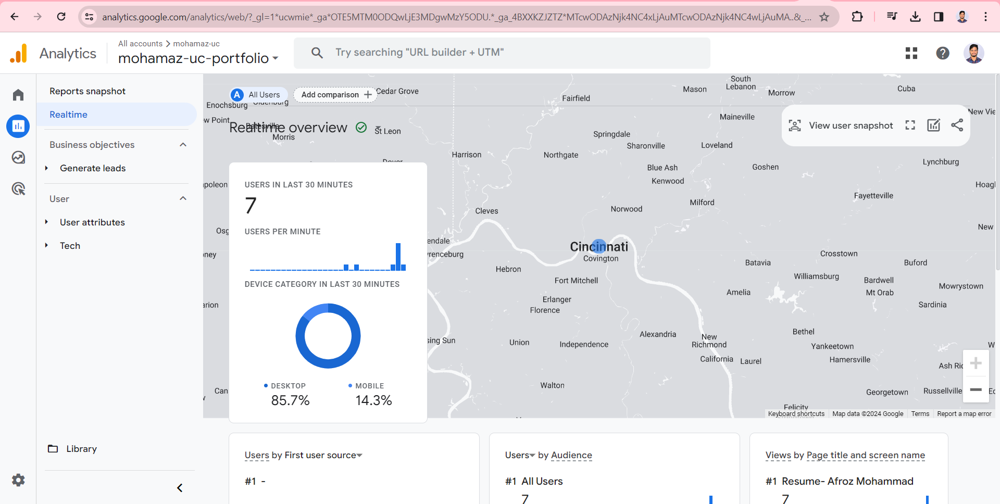

# WAPH-Web Application Programming and Hacking

## Instructor: Dr. Phu Phung

## Student

**Name**: Afroz Mohammad

**Email**: mohamaz@mail.uc.edu


## Individual Project 1 - Professional Profile Website

**Overview**: This project involved creating a front-end professional profile website deployed on GitHub pages. The technical requirements included using basic JavaScript, jQuery, React library, integrating two public APIs, and leveraging JavaScript cookies to store visitor data. Non-technical requirements involved utilizing the open-source Bootstrap framework and adding Google Analytics for page tracking. The goal was to develop a personal portfolio site hosted on GitHub cloud service by applying front-end web development skills like JavaScript, APIs, cookies, frameworks and trackers. This provided practical experience with various technologies to create an effective profile website.

Link to the repository:
[https://github.com/mohamaz-uc/mohamaz-uc.github.io/edit/main/README.md](https://github.com/mohamaz-uc/mohamaz-uc.github.io/edit/main/README.md)

Website URL:
[https://mohamaz-uc.github.io/](https://mohamaz-uc.github.io/)

\pagebreak

To create the personal portfolio i have downloaded a predefined bootstrap template from[https://bootstrapmade.com/iportfolio-bootstrap-portfolio-websites-template/download/](https://bootstrapmade.com/iportfolio-bootstrap-portfolio-websites-template/download/)and customized it as per the project requirements. This portifolio consists of professional profile with my resume, including name, headshot, contact information, background, e.g., education, my experiences and skills. Additonally, a link to new HTML page to show case the Hackathons , Labs which are completed as part of WAPH course work has been added.


\pagebreak


As mentioned, I have integrated Google Analytics to track and monitor the portfolio traffic and get real time statistics. The below image is taken directly from the Google Analytics Website.

Here is the below code of Google Manual Integration:
```JS
<!-- Google tag (gtag.js) -->
<script async src="https://www.googletagmanager.com/gtag/js?id=G-EVWSMF06XG"></script>
<script>
  window.dataLayer = window.dataLayer || [];
  function gtag(){dataLayer.push(arguments);}
  gtag('js', new Date());

  gtag('config', 'G-EVWSMF06XG');
</script>
```

\pagebreak

The technology stack utilized for developing this portfolio website comprised of HTML, CSS, Bootstrap framework, JavaScript and React library. HTML and CSS were used to create the basic structure and styling of the web pages. Additionally, the open-source Bootstrap framework was leveraged to quickly build a responsive layout with navigation menu and grid system for content.

To enhance interactivity, JavaScript was implemented for multiple functions like the typing text animation, dynamic copyright year update, and form data validation. The React library allowed creating modular, reusable UI components for features such as the testimonials section.

jQuery AJAX methods were leveraged to integrate two public APIs into the site - a random joke generator API and a weather widget API. The joke API is used to display a new joke every minute to keep the homepage engaging. The weather widget fetches data based on the visitor's IP address location to serve locally relevant information.

In summary, the combination HTML, CSS, Bootstrap, JavaScript, React and integration with third-party APIs via jQuery enabled building an effective personal portfolio with both aesthetics and dynamic functionality.

The below is the Joke API functionality that took from the Lab 2:
```JS
<script>
function displayJoke(){
	$.get("https://v2.jokeapi.dev/joke/Programming?type=single",function(result){
				if (result && result.joke) {
				$("#response").text("Programming joke of the day: " +result.joke);
				}
				else{
				 $("#response").text("Could not retrieve a joke at this time.");	
				}
			});
		}
		displayJoke();
		setInterval(displayJoke,60*1000);
</script>
```

Weather Widget code that used to display weather. Here i used replaced data lable with "Cincinnati" to retrieve only Cincinnati weather: 
```JS
<div class="weather-widget">
<a class="weatherwidget-io"
 href="https://forecast7.com/en/39d10n84d51/cincinnati/"
	data-label_1="CINCINNATI" data-label_2="WEATHER"
 	data-theme="original" >CINCINNATI WEATHER</a>
<script>
		!function(d,s,id){var js,fjs=d.getElementsByTagName(s)[0];
		if(!d.getElementById(id)){js=d.createElement(s);js.id=id;
		js.src='https://weatherwidget.io/js/widget.min.js';
		fjs.parentNode.insertBefore(js,fjs);}}
(document,'script','weatherwidget-io-js');
</script>
</div>
```


Along with above two web APIs, I also added the functionalities from Lab 2 like Digital Clock, Analog Clock, and Display Email(Show/Hide).

\pagebreak

Apart from the Lab 2, I included a new function below my Navbar that changes the background color of Navbar when the button is clicked

```JS

<button type="button" class="btn btn-primary" onclick="changeBackground()">Change Background</button>

function changeBackground() {
    var backgrounds = ['#040b14', '#183e01', '#664f02', '#026628'];
    var randomIndex = Math.floor(Math.random() * backgrounds.length);
    var selectedBackground = backgrounds[randomIndex];
    
    document.getElementById('header').style.background = selectedBackground;
  }
```


\pagebreak

JavaScript cookies are utilized to remember the user . If they visit the website first time "welcome to my portfolio is displayed" otherwise "welcome back to my portfolio and time" are displayed.

```JS
<script>
<div id="greetingCookie"></div>
function setCookie(name, value, expiryDays) {
            const d = new Date();
            d.setTime(d.getTime() + (expiryDays*24*60*60*1000));
            let expires = "expires="+ d.toUTCString();
            document.cookie = name + "=" + value + ";" + expires + ";path=/";
        }

        function getCookie(name) {
            let cookieName = name + "=";
            let decodedCookie = decodeURIComponent(document.cookie);
            let ca = decodedCookie.split(';');
            for(let i = 0; i <ca.length; i++) {
                let c = ca[i];
                while (c.charAt(0) == ' ') {
                    c = c.substring(1);
                }
                if (c.indexOf(cookieName) == 0) {
                    return c.substring(cookieName.length, c.length);
                }
            }
            return "";
        }

        function welcomeUser() {
            const lastVisit = getCookie("lastVisit");
            const greetingElement = document.getElementById("greetingCookie");
            if (lastVisit) {
                greetingElement.innerHTML =
		 "Welcome back! Your last visit was on " + lastVisit + ".";
            } else {
                greetingElement.innerHTML = "Welcome to my portfolio!";
            }
            const now = new Date();
            setCookie("lastVisit", now.toLocaleString(), 365);
        }

        welcomeUser();
</script>
```


